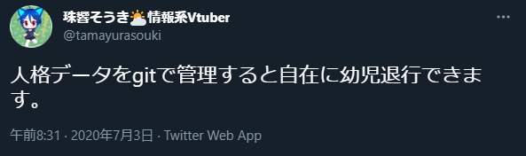

<!--
headingDivider: 1
-->

# そうきちゃん語録で学ぶ IT用語
## #2 Git
<!-- そうきちゃんが発する変な言葉からIT用語を解説するプチ動画です。 -->

# 問題のツイート

- Gitって何?
- Gitがあると自由に幼児退行できるの?

# Gitって何?
- バージョン管理ソフト
- 適宜、ファイルの状態をバックアップできる

# Gitのイメージ
いい感じのグラフの図

# しかも、Gitは無料で使えるオンラインサービスがある

# Gitバブ
あっ違った

# GitHub
Git+開発に役立つ機能がいっぱい
プログラミング以外にも使えるよ

# ということで
実際にGitを使って幼児退行してみましょう